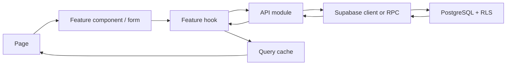

# 폴더 및 컴포넌트 구조 설계

> Phase 2 확정 기준(2026-07-11): `features/customers` 중심이 아니라 `features/dogs`를 주 화면으로 사용한다. `customers`는 반려견에 연결되는 보호자 데이터 계층으로 유지한다. 현재 Phase 1 구조에서는 `src/pages/Pets.tsx`가 반려견 목록·상세·보호자 연결을 담당하며 Phase 2 API 훅으로 교체한다.

Phase 2 추가 경계:

- `src/lib/supabase.ts`: 단일 Supabase client.
- `src/auth/`: 세션, profile, 역할 가드.
- `src/api/`: 테이블/RPC 호출과 한국어 오류 변환.
- `src/types/database.types.ts`: Supabase 생성 타입.
- `supabase/migrations/`: 순차 SQL migration.
- `supabase/seed.sql`: 개발용 seed. 운영 데이터와 분리.

## 1. 구조 원칙

- 기능별 코드를 가까이 두되 지나친 추상화를 만들지 않는다.
- 여러 기능에서 실제로 재사용되는 요소만 공용 컴포넌트로 이동한다.
- 페이지는 조합과 흐름을 담당하고, 데이터 규칙은 API/도메인 계층에 둔다.
- Supabase 호출을 화면 컴포넌트에 직접 작성하지 않는다.
- 서버 데이터는 TanStack Query, 입력 중인 화면 상태는 폼 또는 로컬 상태로 관리한다.

## 2. 제안 폴더 구조

```text
/
├─ docs/                         # 승인 후 필요 시 Phase 문서 이동(초기에는 루트 유지)
├─ public/
├─ src/
│  ├─ app/
│  │  ├─ App.tsx
│  │  ├─ router.tsx
│  │  ├─ providers.tsx
│  │  └─ queryClient.ts
│  ├─ assets/
│  ├─ components/
│  │  ├─ ui/                    # Button, Input, Select, Modal 등
│  │  └─ layout/                # AppShell, Sidebar, Header
│  ├─ features/
│  │  ├─ auth/
│  │  │  ├─ api/
│  │  │  ├─ components/
│  │  │  ├─ hooks/
│  │  │  ├─ pages/
│  │  │  ├─ schemas.ts
│  │  │  └─ types.ts
│  │  ├─ sales/
│  │  │  ├─ api/
│  │  │  ├─ components/
│  │  │  ├─ hooks/
│  │  │  ├─ pages/
│  │  │  ├─ schemas.ts
│  │  │  └─ types.ts
│  │  ├─ products/
│  │  │  └─ (동일 구조)
│  │  ├─ categories/
│  │  │  └─ (동일 구조)
│  │  └─ users/
│  │     └─ (동일 구조)
│  ├─ hooks/                    # 전역 공용 훅만 배치
│  ├─ lib/
│  │  ├─ supabase.ts
│  │  ├─ env.ts
│  │  ├─ currency.ts
│  │  ├─ date.ts
│  │  └─ errors.ts
│  ├─ styles/
│  │  ├─ tokens.css
│  │  ├─ globals.css
│  │  └─ utilities.css
│  ├─ types/
│  │  ├─ database.types.ts      # Supabase 생성 타입
│  │  └─ common.ts
│  └─ main.tsx
├─ supabase/
│  ├─ migrations/
│  ├─ seed.sql                  # 개발용 최소 데이터
│  └─ tests/                    # RLS와 DB 함수 테스트
├─ tests/
│  ├─ setup.ts
│  └─ e2e/
├─ .env.example
├─ package.json
├─ tsconfig.json
├─ vite.config.ts
└─ 7개 Phase 0 설계 문서
```

폴더는 해당 기능 개발 단계가 시작될 때 필요한 범위만 생성한다. 빈 폴더를 한 번에 만들지 않는다.

## 3. 앱 계층

### `app/`

- `App.tsx`: 앱 최상위 렌더링.
- `router.tsx`: 경로, 인증 가드, 관리자 가드.
- `providers.tsx`: Query, Router, 전역 알림 등 공급자 조합.
- `queryClient.ts`: 서버 캐시 기본 정책.

### `components/layout/`

- `AppShell`: 인증된 화면 공통 틀.
- `Sidebar`: 권한별 메뉴.
- `Header`: 페이지 맥락, 사용자, 로그아웃.
- `PageHeader`: 제목, 설명, 주요 행동의 일관된 배치.

### `components/ui/`

최소 공용 요소:

- `Button`
- `TextInput`
- `Select`
- `DateInput`
- `CurrencyInput`
- `FormField`
- `Table`
- `StatusBadge`
- `Modal`
- `ConfirmDialog`
- `Toast`
- `LoadingState`
- `EmptyState`
- `ErrorState`
- `Pagination`(실제 데이터량상 필요할 때 적용)

## 4. 기능별 컴포넌트

### 인증 `features/auth`

- 페이지: `LoginPage`, `ForbiddenPage`
- 컴포넌트: `LoginForm`, `RequireAuth`, `RequireAdmin`
- 훅: `useSession`, `useCurrentProfile`
- API: 로그인, 로그아웃, 현재 프로필 조회

### 매출 `features/sales`

- 페이지: `SalesListPage`, `SaleCreatePage`, `SaleEditPage`
- 컴포넌트: `SalesFilters`, `SalesSummary`, `SalesTable`, `SaleForm`
- 훅: `useSales`, `useSale`, `useCreateSale`, `useUpdateSale`
- API: 목록/단건 조회, `create_sale`, `update_sale` RPC 호출
- 스키마: 매출일, 상품, 판매가, 메모 검증

`SaleForm`은 등록과 수정에서 공유하되, 페이지가 초기값과 저장 함수를 주입한다. 등록/수정의 업무 규칙이 달라지면 억지로 하나로 합치지 않는다.

### 상품 `features/products`

- 페이지: `ProductListPage`, `ProductCreatePage`, `ProductEditPage`
- 컴포넌트: `ProductFilters`, `ProductsTable`, `ProductForm`, `ProductStatusDialog`
- 훅: `useProducts`, `useProduct`, `useCreateProduct`, `useUpdateProduct`, `useSetProductActive`
- API: 상품 조회·생성·수정·상태 변경

### 상품 분류 `features/categories`

- 페이지: `CategoryManagementPage`
- 컴포넌트: `DivisionTabs`, `CategoryList`, `CategoryDialog`, `CategoryStatusDialog`
- 훅: `useCategories`, `useCreateCategory`, `useUpdateCategory`, `useSetCategoryActive`
- API: 사업부별 분류 조회·생성·수정·상태 변경

`CategoryDialog`는 상품 폼의 “새 분류 만들기”에서도 재사용한다.

### 사용자 `features/users`

- 페이지: `UserManagementPage`
- 컴포넌트: `UsersTable`, `UserEditDialog`
- 훅: `useUsers`, `useUpdateUser`
- API: 관리자용 사용자 목록·권한·활성 상태 변경

## 5. 데이터 흐름



- 조회 키는 기능별 팩토리로 일관되게 관리한다.
- 생성·수정 성공 시 관련 목록과 단건 쿼리만 무효화한다.
- API 오류는 공통 오류 형태로 변환하되 사용자 메시지는 기능 맥락에 맞게 표시한다.
- DB 생성 타입을 API 경계에서 사용하고 폼 타입과 구분한다.

## 6. 테스트 배치

- 순수 포맷/검증 함수: 파일 옆 `*.test.ts`.
- 컴포넌트 상호작용: 파일 옆 `*.test.tsx`.
- 기능 통합 흐름: 기능 폴더의 `*.integration.test.tsx`.
- 주요 사용자 경로: `tests/e2e/`.
- RLS와 RPC: `supabase/tests/`.

## 7. 금지 기준

- 화면 컴포넌트에서 직접 SQL 또는 무분별한 Supabase 쿼리를 실행하지 않는다.
- 전역 상태에 모든 폼과 필터를 넣지 않는다.
- 하나의 거대한 공용 컴포넌트로 서로 다른 업무 화면을 강제 통합하지 않는다.
- 실제 재사용 사례가 없는 추상 계층, 서비스 로케이터, 범용 저장소 패턴을 미리 만들지 않는다.
- UI 권한 처리만 믿고 RLS를 생략하지 않는다.
