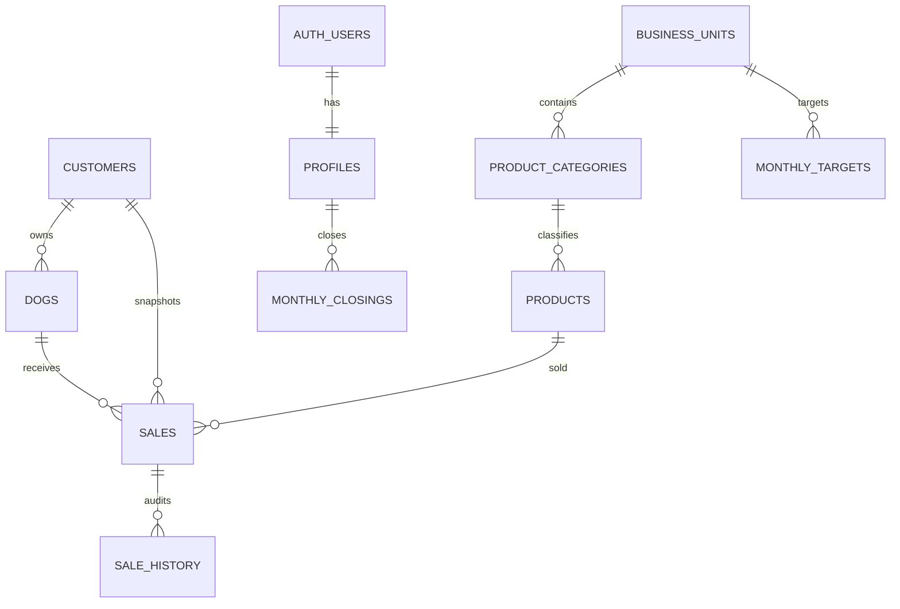
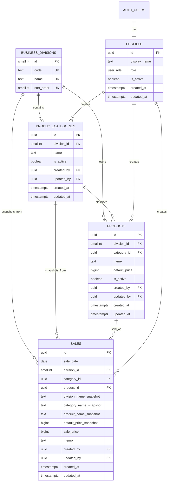

# 데이터베이스 및 Supabase 스키마 설계

> Phase 2 확정 기준(2026-07-11): 아래 초기 설계보다 첨부 승인안의 `business_units`, `customers`, `dogs`, `product_categories`, `products`, `sales`, `sale_history`, `monthly_targets`, `monthly_closings` 구조를 우선한다. `dogs.customer_id`, `sales.customer_id`, `sales.customer_name`은 nullable이며 반려견이 UI의 주 엔터티다. 실제 실행 스키마의 최종 기준은 `supabase/migrations/`의 순차 migration이다.

## Phase 2 관계

금액은 0 이상의 정수로 저장하고 `net_amount = paid_amount - refund_amount - outstanding_amount`를 DB에서 검증한다. 매출 저장 시 사업부, 반려견, 보호자, 분류, 상품 표시값을 스냅샷으로 보존한다. 모든 업무 테이블은 RLS를 활성화한다.

## 1. 설계 원칙

- PostgreSQL을 사용하는 Supabase를 기준으로 한다.
- 모든 업무 테이블은 UUID 기본키를 사용한다.
- 금액은 원화 정수 `bigint`로 저장한다.
- 생성·수정 시각은 `timestamptz`로 저장한다.
- 사업부는 고정값이며 사용자 화면에서 수정하지 않는다.
- 과거 매출의 의미가 바뀌지 않도록 매출 저장 시 표시값과 가격을 스냅샷으로 보존한다.
- 참조 중인 상품과 분류는 물리 삭제하지 않고 `is_active`로 비활성화한다.

## 2. ERD

## 3. 테이블 명세

### 3.1 `profiles`

Supabase `auth.users`와 1:1로 연결되는 내부 사용자 정보다.

| 컬럼 | 타입 | 제약 | 설명 |
|---|---|---|---|
| `id` | `uuid` | PK, FK → `auth.users.id` | 인증 사용자 ID |
| `display_name` | `text` | NOT NULL, 길이 1~50 | 화면 표시 이름 |
| `role` | `user_role` | NOT NULL, 기본 `staff` | `admin`, `staff` |
| `is_active` | `boolean` | NOT NULL, 기본 `true` | 내부 접근 허용 여부 |
| `created_at` | `timestamptz` | NOT NULL, 기본 `now()` | 생성 시각 |
| `updated_at` | `timestamptz` | NOT NULL, 기본 `now()` | 수정 시각 |

### 3.2 `business_divisions`

고정 사업부 마스터다. 초기 마이그레이션에서만 입력하며 앱에서는 변경하지 않는다.

| 컬럼 | 타입 | 제약 | 설명 |
|---|---|---|---|
| `id` | `smallint` | PK | 고정 식별자 |
| `code` | `text` | UNIQUE, NOT NULL | `kindergarten`, `education_center`, `hotel` |
| `name` | `text` | UNIQUE, NOT NULL | 유치원, 교육센터, 호텔 |
| `sort_order` | `smallint` | UNIQUE, NOT NULL | 화면 표시 순서 |

초기 데이터:

| id | code | name | sort_order |
|---:|---|---|---:|
| 1 | `kindergarten` | 유치원 | 1 |
| 2 | `education_center` | 교육센터 | 2 |
| 3 | `hotel` | 호텔 | 3 |

### 3.3 `product_categories`

| 컬럼 | 타입 | 제약 | 설명 |
|---|---|---|---|
| `id` | `uuid` | PK, 기본 `gen_random_uuid()` | 분류 ID |
| `division_id` | `smallint` | NOT NULL, FK | 소속 사업부 |
| `name` | `text` | NOT NULL, 길이 1~50 | 분류명 |
| `is_active` | `boolean` | NOT NULL, 기본 `true` | 선택 가능 여부 |
| `created_by` | `uuid` | NOT NULL, FK → `profiles.id` | 생성자 |
| `updated_by` | `uuid` | NOT NULL, FK → `profiles.id` | 최종 수정자 |
| `created_at` | `timestamptz` | NOT NULL, 기본 `now()` | 생성 시각 |
| `updated_at` | `timestamptz` | NOT NULL, 기본 `now()` | 수정 시각 |

제약 및 인덱스:

- `unique (division_id, lower(name))`: 같은 사업부 안에서 대소문자만 다른 중복 이름 금지. 실제 마이그레이션에서는 표현식 UNIQUE 인덱스로 구현한다.
- 이름은 앞뒤 공백 제거 후 빈 문자열을 허용하지 않는다.
- `index (division_id, is_active, name)`: 사업부별 활성 분류 조회.
- 상품이 연결된 분류는 비활성화할 수 있지만, 활성 상품이 남아 있다면 UI에서 먼저 경고하고 차단한다.

### 3.4 `products`

| 컬럼 | 타입 | 제약 | 설명 |
|---|---|---|---|
| `id` | `uuid` | PK, 기본 `gen_random_uuid()` | 상품 ID |
| `division_id` | `smallint` | NOT NULL, FK | 소속 사업부 |
| `category_id` | `uuid` | NOT NULL, FK | 상품 분류 |
| `name` | `text` | NOT NULL, 길이 1~100 | 상품명 |
| `default_price` | `bigint` | NOT NULL, CHECK `>= 0` | 기본 판매가(원) |
| `is_active` | `boolean` | NOT NULL, 기본 `true` | 매출 등록 시 선택 가능 여부 |
| `created_by` | `uuid` | NOT NULL, FK → `profiles.id` | 생성자 |
| `updated_by` | `uuid` | NOT NULL, FK → `profiles.id` | 최종 수정자 |
| `created_at` | `timestamptz` | NOT NULL, 기본 `now()` | 생성 시각 |
| `updated_at` | `timestamptz` | NOT NULL, 기본 `now()` | 수정 시각 |

제약 및 인덱스:

- 분류와 상품의 사업부 일치를 데이터베이스에서 강제한다.
- 이를 위해 `product_categories (id, division_id)`에 UNIQUE 제약을 추가하고, `products (category_id, division_id)`가 복합 FK로 참조한다.
- `unique (division_id, lower(name))`: 같은 사업부 내 상품명 중복 금지.
- `index (division_id, category_id, is_active, name)`: 매출 등록 상품 조회.
- 삭제 API는 만들지 않고 활성 상태 변경만 제공한다.

### 3.5 `sales`

Phase 0에서 확정된 최소 매출 단위는 “한 행에 상품 1개”다. 수량, 고객, 결제수단, 담당자 배정 등 승인되지 않은 필드는 포함하지 않는다.

| 컬럼 | 타입 | 제약 | 설명 |
|---|---|---|---|
| `id` | `uuid` | PK, 기본 `gen_random_uuid()` | 매출 ID |
| `sale_date` | `date` | NOT NULL | 매출 일자 |
| `division_id` | `smallint` | NOT NULL, FK | 당시 사업부 참조 |
| `category_id` | `uuid` | NOT NULL, FK | 당시 분류 참조 |
| `product_id` | `uuid` | NOT NULL, FK | 당시 상품 참조 |
| `division_name_snapshot` | `text` | NOT NULL | 저장 당시 사업부명 |
| `category_name_snapshot` | `text` | NOT NULL | 저장 당시 분류명 |
| `product_name_snapshot` | `text` | NOT NULL | 저장 당시 상품명 |
| `default_price_snapshot` | `bigint` | NOT NULL, CHECK `>= 0` | 저장 당시 기본 판매가 |
| `sale_price` | `bigint` | NOT NULL, CHECK `>= 0` | 실제 판매가 |
| `memo` | `text` | NULL, 최대 500자 | 선택 메모 |
| `created_by` | `uuid` | NOT NULL, FK → `profiles.id` | 등록자 |
| `updated_by` | `uuid` | NOT NULL, FK → `profiles.id` | 최종 수정자 |
| `created_at` | `timestamptz` | NOT NULL, 기본 `now()` | 생성 시각 |
| `updated_at` | `timestamptz` | NOT NULL, 기본 `now()` | 수정 시각 |

인덱스:

- `index (sale_date desc)`: 최근 매출 조회.
- `index (division_id, sale_date desc)`: 사업부·기간 필터.
- `index (product_id, sale_date desc)`: 상품별 이력 조회.
- `index (created_by, sale_date desc)`: 등록자별 조회.

## 4. 저장 프로시저와 트리거

### 4.1 공통 `updated_at`

수정 가능한 테이블에 `before update` 트리거를 적용해 `updated_at = now()`를 강제한다.

### 4.2 매출 저장 함수

클라이언트가 스냅샷 값을 임의로 보내지 않도록 `create_sale` RPC를 사용한다.

입력:

- `p_sale_date`
- `p_product_id`
- `p_sale_price`
- `p_memo`

처리:

1. 로그인 및 활성 사용자 여부 확인.
2. 상품, 분류, 사업부를 한 번에 조회.
3. 신규 등록 시 상품과 분류의 활성 상태 확인.
4. 상품 기준으로 참조 ID와 스냅샷 값을 서버에서 채움.
5. `created_by`, `updated_by`를 `auth.uid()`로 저장.
6. 한 트랜잭션으로 매출 행을 생성.

`update_sale` RPC는 일자, 상품, 실제 판매가, 메모만 수정 가능하게 하고 스냅샷을 다시 계산한다. 매출 물리 삭제는 초기 범위에서 제공하지 않는다.

## 5. RLS 정책

모든 공개 업무 테이블에 RLS를 활성화한다.

| 테이블 | SELECT | INSERT | UPDATE | DELETE |
|---|---|---|---|---|
| `profiles` | 활성 사용자는 본인, 관리자는 전체 | 인증 생성 흐름/관리 함수만 | 본인 제한 필드, 관리자는 역할·활성 상태 | 금지 |
| `business_divisions` | 활성 사용자 | 금지 | 금지 | 금지 |
| `product_categories` | 활성 사용자 | 관리자 | 관리자 | 금지 |
| `products` | 활성 사용자 | 관리자 | 관리자 | 금지 |
| `sales` | 활성 사용자 | RPC를 통한 활성 사용자 | RPC를 통한 활성 사용자 | 금지 |

- RLS 판정용 `is_active_user()`와 `is_admin()` 보안 함수를 별도 스키마에 둔다.
- 함수에는 고정 `search_path`를 설정하고 필요한 권한만 부여한다.
- 서비스 역할 키는 브라우저에 절대 노출하지 않는다.

## 6. 데이터 정합성 규칙

- 사업부 3개는 마이그레이션으로 고정하고 앱에서 수정하지 않는다.
- 비활성 분류는 신규·수정 상품에서 선택할 수 없다.
- 비활성 상품은 신규 매출에서 선택할 수 없다.
- 기존 매출은 연결 상품이나 분류가 비활성화되어도 조회 가능하다.
- 가격은 0원 이상 정수만 허용한다.
- 매출 스냅샷은 상품 마스터 변경과 독립적으로 유지한다.
- 사용자에 의한 업무 데이터 물리 삭제는 허용하지 않는다.

## 7. 마이그레이션 순서

1. enum 및 공통 함수 생성.
2. `profiles` 생성과 인증 사용자 연동.
3. `business_divisions` 생성 및 고정 3개 값 입력.
4. `product_categories` 생성.
5. `products` 생성과 사업부 일치 복합 FK 구성.
6. `sales` 생성.
7. 인덱스와 `updated_at` 트리거 생성.
8. 매출 RPC 생성.
9. RLS 활성화와 정책 생성.
10. 스키마·RLS·RPC 통합 테스트 실행.
