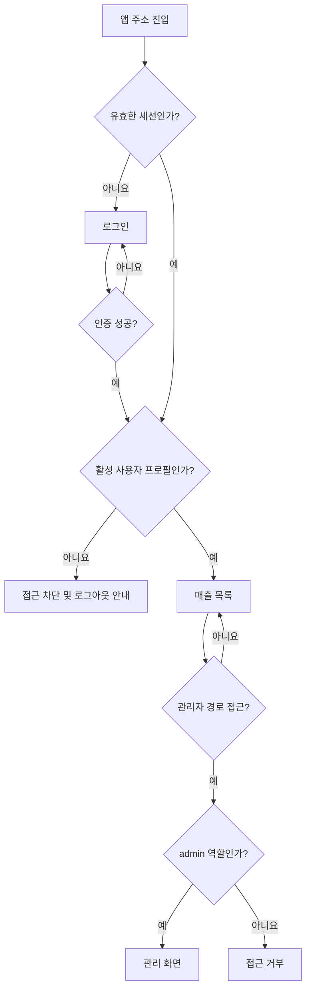
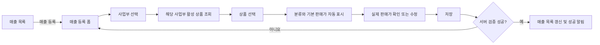
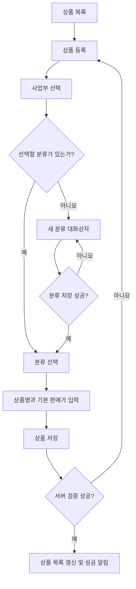

# 페이지 이동 및 업무 흐름 설계

> Phase 2 확정 기준(2026-07-12): 호환성을 위해 `/customers` 경로는 유지하지만 화면 의미와 메뉴명은 `반려견 관리`다. 인증은 Supabase Email + Password 로그인만 사용한다. Magic Link, OTP, 이메일 링크, 비밀번호 재설정 이메일, 공개 회원가입은 제공하지 않는다.


마감 월 또는 권한 없는 변경은 프런트엔드 안내와 데이터베이스 함수/RLS에서 함께 차단한다.

## 1. 경로 목록

| 경로 | 화면 | 접근 권한 | 진입 방식 |
|---|---|---|---|
| `/login` | 로그인 | 비로그인 | 직접 접근, 세션 만료 |
| `/` | 매출 목록으로 이동 | 로그인 | 앱 진입 |
| `/sales` | 매출 목록 | 직원·관리자 | 기본 메뉴 |
| `/sales/new` | 매출 등록 | 직원·관리자 | 매출 목록의 등록 버튼 |
| `/sales/:saleId/edit` | 매출 수정 | 직원·관리자 | 매출 행의 수정 버튼 |
| `/products` | 상품 목록 | 관리자 | 관리자 메뉴 |
| `/products/new` | 상품 등록 | 관리자 | 상품 목록의 등록 버튼 |
| `/products/:productId/edit` | 상품 수정 | 관리자 | 상품 행의 수정 버튼 |
| `/categories` | 상품 분류 관리 | 관리자 | 관리자 메뉴 |
| `/users` | 사용자 관리 | 관리자 | 관리자 메뉴 |
| `/forbidden` | 접근 거부 | 로그인 | 권한 가드 |
| `*` | 찾을 수 없음 | 전체 | 잘못된 주소 |

## 2. 인증 및 권한 흐름



- 로그인 상태에서 `/login`에 접근하면 `/sales`로 이동한다.
- 로그인이 필요한 원래 주소는 로그인 후 복귀할 수 있도록 위치 상태에 보관한다.
- 직원이 관리자 주소를 직접 입력하면 `/forbidden`으로 이동한다.
- 세션 만료 시 로그인으로 이동하고 저장되지 않은 변경이 있음을 안내한다.

## 3. 매출 등록 흐름



- 취소를 누르면 입력 변경 여부를 확인한 뒤 매출 목록으로 이동한다.
- 사업부 변경 시 상품·분류·가격 선택을 초기화한다.
- 저장 요청은 한 번만 처리하며 완료 전 중복 클릭을 막는다.

## 4. 상품 등록 흐름



## 5. 비활성화 흐름

### 상품

1. 관리자가 상품 목록에서 상태 전환을 선택한다.
2. 프로그램이 해당 상품이 신규 매출에서 제외된다는 내용을 확인한다.
3. 확인 시 `is_active = false`로 변경한다.
4. 과거 매출과 상품 정보는 유지된다.
5. 재활성화하면 신규 매출에서 다시 선택할 수 있다.

### 상품 분류

1. 관리자가 분류 상태 전환을 선택한다.
2. 활성 상품 연결 수를 확인한다.
3. 활성 상품이 있으면 비활성화를 차단하고 상품 이동 또는 비활성화를 안내한다.
4. 활성 상품이 없으면 분류를 비활성화한다.
5. 과거 상품과 매출 참조는 유지된다.

## 6. 목록 상태와 URL

- 매출 목록의 기간, 사업부, 상품, 검색어는 URL 쿼리 문자열로 유지한다.
- 상품 목록의 사업부, 분류, 활성 상태, 검색어도 URL 쿼리 문자열로 유지한다.
- 수정 후 목록으로 돌아갈 때 이전 필터가 유지되어야 한다.
- 잘못된 쿼리 값은 안전한 기본값으로 정규화한다.

예시:

```text
/sales?from=2026-07-01&to=2026-07-31&division=1&product=uuid&q=호텔
/products?division=3&category=uuid&status=active&q=장기
```

## 7. 이탈 방지

- 폼 값이 초기값과 다르고 저장되지 않았다면 내부 이동, 뒤로 가기, 창 닫기 시 경고한다.
- 저장 성공 후에는 변경 상태를 초기화하여 불필요한 경고가 나오지 않게 한다.
- 단순 조회 화면에서는 이탈 경고를 사용하지 않는다.
