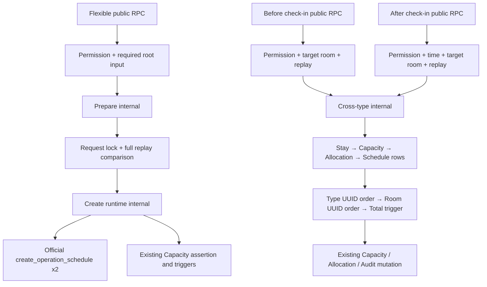

# Hotel Internal Helper Extraction — Implementation and QA Package

## Scope

This package performs one meaning-preserving refactor only.

| Category | Exact scope |
|---|---|
| New internal functions | `prepare_hotel_reservation_runtime_input_internal`, `create_hotel_reservation_runtime_internal`, `change_hotel_room_type_and_allocation_internal` |
| Replaced public definitions | `create_flexible_hotel_reservation`, `change_room_type_before_check_in`, `change_room_type_after_check_in` |
| Public signature/metadata/ACL diff | 0 |
| Frozen functions | Checkout, reverse completion, Snapshot v2 and every other existing function |
| Forbidden runtime | Long Stay tables/functions/triggers and PostgreSQL infinity values |

## Public ACL provenance

The approved public RPC ACL is exactly `authenticated`, `postgres`, and
`service_role`. The original Flexible and Room Board migrations revoke
`PUBLIC`/`anon` and grant `authenticated`; Supabase's `postgres` default
function ACL supplies `service_role`, so production retained it as part of the
effective migration contract. No current service-role client directly invokes
these RPCs, but a meaning-preserving extraction must not narrow an existing
public contract.

Clean QA temporarily differed because the first helper-extraction rehearsal
used the earlier package rollback. That rollback explicitly revoked
`service_role` from the three restored public functions, and the following
reapply preserved the narrowed input state. The QA bootstrap, Operations
repairs, Family Booking package, and Canonical runner did not remove this ACL.
The corrected rollback and migration now restore/preserve the approved exact
three-role set, while the internal helpers remain executable by `postgres`
only.

## Package files

1. `supabase/verification/202608070003_hotel_internal_helper_extraction_preflight.sql`
2. `supabase/migrations/202608070003_hotel_internal_helper_extraction.sql`
3. `supabase/verification/202608070003_hotel_internal_helper_extraction_postflight.sql`
4. `supabase/verification/202608070003_hotel_internal_helper_extraction_rollback.sql`
5. Existing Golden suites, executed unchanged before and after:
   - `supabase/verification/202608040002_hotel_flexible_reservations_transaction_qa.sql`
   - `supabase/verification/202608050001_hotel_room_board_cross_type_transaction_qa.sql`
6. `supabase/qa/hotel-helper-extraction/00_golden_contract_capture.sql`
7. `supabase/qa/hotel-helper-extraction/10_session_a.sql`
8. `supabase/qa/hotel-helper-extraction/11_session_b.sql`
9. `supabase/qa/hotel-helper-extraction/12_results.sql`

## Before / After fingerprints

| Function | Before `md5(prosrc)` | After `md5(prosrc)` | Contract diff |
|---|---|---|---|
| `create_flexible_hotel_reservation` | `cad788cb79875fab06f0d84470da4698` | `cca668cd6142942eb9af87dcfada05d8` | 0 |
| `change_room_type_before_check_in` | `39c760d45df40a92cb3b82ceea8a48ea` | `e18904d6698133d3b735af55d3e2209f` | 0 |
| `change_room_type_after_check_in` | `7b2a2f0b1c24a3a6d92ac37d400c97d7` | `34804fd6ef82d8ac99cd042816d3e93b` | 0 |
| input preparation helper | absent | `471673afbfe5dfff9fcac28356b07603` | internal |
| create runtime helper | absent | `48d9146603c1462a02cb8df65458cc8f` | internal |
| cross-type runtime helper | absent | `2a344bee4a21279f1d6a4a7c4dac1445` | internal |

The public fingerprints intentionally change because the bodies become wrappers. A passing fingerprint is never treated as proof of semantic equivalence by itself.

The frozen `complete_hotel_check_out` input contract is the approved
production definition `7744baa7276dcb70676ec593e8ddc0e6`. Its statement,
SQLSTATE, lock, replay, audit and late-checkout semantics are identical to the
older Git-formatted `2cdbabd36b980112dd8ae4c46f40c838` body; only the exact
production definition is accepted by this release package.

## Call graph

## Semantic equivalence comparison

The same isolated QA database snapshot is used twice:

1. Run both existing Golden transaction suites before extraction; save their result grids and the capture query output.
2. Roll back every fixture transaction.
3. Run Preflight → Migration → Postflight.
4. Run the same suites again with identical fixture inputs.
5. Compare canonical graphs after replacing generated object IDs by role (`stay`, `check_in_schedule`, `check_out_schedule`, `capacity`, `allocation`).

PASS requires all of the following:

- success JSON has the same key set and non-generated values;
- identical request replay returns the same Stay and changes no row/version/audit;
- request IDs remain on the same root/link entities;
- SQLSTATE and message match for every Golden failure;
- Stay, Capacity, Allocation and Schedule row counts/values/version deltas match;
- Audit entity/action/reason/request_id/changed_by and event counts match;
- failure injection leaves every affected table unchanged;
- advisory namespaces and relative acquisition order remain Request → Row → Room Type → Room → Total Capacity.

## Golden fixtures

The metadata/fingerprint capture is only an installation guard. It is not a
runtime semantic-equivalence result. Before and After runtime captures must
use an identical seeded database snapshot and identical actor/JWT context.

Every fixture emits one canonical JSON document containing the returned JSON
or SQLSTATE/message, the complete Stay, all Capacity rows, Event Links,
Schedules, sorted Assignee/Customer/Dog links, Allocation segments, Audits and
row counts. Generated IDs are replaced only through an explicit role map:
`stay`, `capacity`, `check_in_event`, `check_out_event`,
`check_in_schedule`, `check_out_schedule`, `allocation[n]` and `audit[n]`.
Creation/update timestamps are replaced with timestamp role tokens. Business
timestamps, versions, statuses, descriptions, reasons, actors, request
relationships, intervals and counts are never normalized. The resulting
canonical documents must compare exactly.

### Flexible create

- confirmed check-in and checkout times;
- check-in time unspecified only;
- checkout time unspecified only;
- both times unspecified;
- room type unspecified;
- whitespace memo;
- NULL memo and empty memo;
- identical replay and different-payload replay rejection;
- type Capacity conflict;
- Customer/Dog mismatch;
- invalid Calendar/Schedule Type;
- Audit or downstream Schedule failure with full rollback.

Every successful create captures Schedule `starts_at`, `ends_at`, `all_day`,
`time_unspecified`, `description`, sorted Assignee/Customer/Dog links and both
child request IDs. Child UUID values are role-normalized, but uniqueness and
association with the correct Schedule are exact assertions.

### Before check-in cross-type change

- both directions;
- same type rejection `22023`;
- identical replay and different-payload replay rejection;
- version `40001`, Capacity `23514` and target Room `23P01` conflicts;
- Capacity type, replacement Allocation and Stay version delta;
- exact Schedule graph immutability;
- Root Audit reason/request/changed_by/count;
- Root Audit failure injection with full rollback.

### After check-in cross-type change

- both directions;
- effective time boundary;
- same type, version, Capacity and Room conflict;
- identical replay;
- root Audit and changed_by;
- failed call preserves prior Capacity, Allocation segments, Stay, Schedule and Audit.

## Statement-order review gate

The review records statement ordinals for the approved source and extracted
call graph. Required order:

- Create: permission → required root input → preparation validation → request
  lock → replay → type Capacity assertion → check-in Schedule → checkout
  Schedule → Audit context → Stay → Event Links → Capacity → return.
- Cross-type: permission/input/target Room → request lock → replay → Stay row
  → Capacity row → Allocation row → Schedule rows → sorted Type locks → sorted
  Room locks → type Capacity assertion → Room overlap check → Allocation and
  Capacity mutation → official Room assertion → new Allocation → Stay Root
  Audit → return.

Pure value calculation movement is reported separately. Moving a lock,
volatile DB read, assertion or mutation is a semantic failure.

## Two-session QA

Each scenario uses two actual database connections, a shared far-future fixture, unique request IDs unless replay is the subject, and `lock_timeout`/`statement_timeout` guards.

| Scenario | Session A | Session B | PASS |
|---|---|---|---|
| Same create request | Flexible create | Same payload/request | one mutation graph, both return same Stay |
| Last type Capacity | Flexible create | Existing confirmed create | one success or normal `23514`, no `40P01` |
| Cross-type vs create | STANDARD→DELUXE | Last DELUXE create | one success or `23514`, no partial rows |
| Opposite cross-type | A: STANDARD→DELUXE | B: DELUXE→STANDARD | UUID lock order prevents `40P01` |
| Same target Room | Cross-type move | Assign/move to same Room | one success or `23P01` |
| Same Stay | Before/after change | same Stay stale version | one success, loser `40001` or state error |

Expected SQLSTATE set is `23514`, `23P01`, `40001`, `22023` or success. `40P01` is always FAIL. After each scenario the results query verifies one active Capacity per Stay, valid Allocation intervals, exactly one successful Root Audit per successful request, and zero rows from failed mutations.

## Clean QA execution plan

1. Confirm isolated QA guard and project ref; hard-block the production ref.
2. Restore the approved pre-extraction fingerprint state.
3. Run the Golden capture and existing transaction suites; archive result grids as `before`.
4. Run Preflight and require `READY_TO_APPLY_HOTEL_INTERNAL_HELPER_EXTRACTION`.
5. Run Migration.
6. Run Postflight and require `HOTEL_INTERNAL_HELPER_EXTRACTION_READY`.
7. Run the Golden capture and transaction suites again; require semantic diff 0.
8. Run the two-session suite; require zero `40P01` and atomic failure outcomes.
9. In a rollback-only branch, run Rollback and require the three original fingerprints plus helper count 0.
10. Reapply only in Clean QA and repeat Postflight. Stop and report; do not touch production.

No SQL in this package was executed against QA or production during its
authoring. Subsequent execution was performed only through the approved QA and
release gates.

## Production release verification

On 2026-08-07 the approved package was applied to production project
`zorvcuskzemehblqdbfj` after
`READY_TO_APPLY_HOTEL_INTERNAL_HELPER_EXTRACTION`. The migration completed and
the immediate and post-UI read-only checks both returned
`HOTEL_INTERNAL_HELPER_EXTRACTION_READY`; the combined Operations, Hotel,
Family Booking and Long Stay-absence regression returned
`HOTEL_HELPER_EXTRACTION_RELEASE_REGRESSION_READY`.

Production UI smoke covered Hotel Operations and Room Board, Calendar, Today,
Customer/Dog profiles and the Family Booking create-only entry surface. No
reservation, allocation, schedule, customer, dog or Family Booking mutation was
submitted. This release contains no frontend source change and requires no
manual Netlify deploy.
