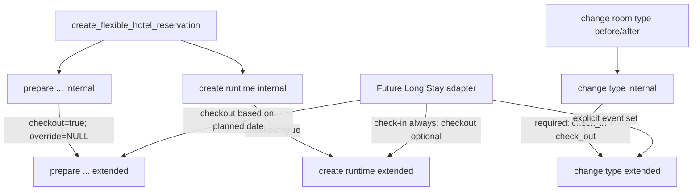

# Hotel Internal Helper Long Stay Extension

## Decision

Strategy **B** is selected: the three existing helper signatures remain and
become thin compatibility wrappers; three new extended helpers own the single
business-logic implementation.

This is the only option that simultaneously keeps all three public RPC
definitions byte-for-byte unchanged, retains one business-logic source, and
provides explicit Long Stay event contracts.

| Strategy | Public definition diff | Logic source | Result |
|---|---:|---:|---|
| A. Change existing signatures | 3 callers must change | 1 | Rejected |
| B. Compatibility wrapper + extended helper | 0 | 1 | Selected |
| C. Overload with copied body | 0 | 2 | Rejected |

## Function diff

| Object | Before | After | Definition diff |
|---|---|---|---:|
| `prepare_hotel_reservation_runtime_input_internal` | implementation | thin wrapper, Hotel defaults | 1 |
| `create_hotel_reservation_runtime_internal` | implementation | thin wrapper, checkout required | 1 |
| `change_hotel_room_type_and_allocation_internal` | implementation | thin wrapper, two required events | 1 |
| Public Hotel RPCs | current production definitions | unchanged | 0 |
| Other existing functions | current production definitions | unchanged | 0 |
| Existing triggers | current production definitions | unchanged | 0 |

New postgres-only helpers:

1. `prepare_hotel_reservation_runtime_input_extended_internal(...)`
2. `create_hotel_reservation_runtime_extended_internal(...)`
3. `change_hotel_room_type_and_allocation_extended_internal(...)`

Expected postflight body fingerprints:

| Helper | Expected `md5(prosrc)` |
|---|---|
| prepare compatibility | `a381a89f745550528114030dad88f954` |
| create compatibility | `e00da45677db792f67d73271671062e9` |
| cross-type compatibility | `2e1d1d038e5013e68b668b794e92f812` |
| prepare extended | `20bdaf193ebba7ef970d7b160a380f2a` |
| create extended | `6c1ab1e0f7f6aa10ad7811699fc917c7` |
| cross-type extended | `dc5c996ccff3e3416a31451e512d0f1c` |

## Call graph

## Optional checkout contract

The prepare extension receives both:

- `p_include_check_out_event boolean`
- `p_capacity_until_override timestamptz`

The event decision is never inferred from a nullable date. When checkout is
excluded, `checkOutScheduleAt`, `expectedCheckOutEndsAt`, and `checkOutTitle`
are JSON null. A capacity boundary remains mandatory and is independent of the
checkout schedule. The future Long Stay coordinator may supply its approved
runtime hold; this package does not use or create infinity itself.

The runtime extension checks that its explicit boolean agrees with the prepared
JSON contract. It always creates one check-in Schedule/Event and creates a
checkout Schedule/Event only when requested. A null schedule ID is never stored.

## Required event contract

The cross-type extension receives `p_required_event_kinds text[]`.

- values are restricted to `check_in | check_out`;
- duplicates in the requested set are rejected;
- every requested active event must exist exactly once;
- active unexpected event kinds are rejected;
- every linked Schedule must be active;
- only validated required Schedules are locked, deterministically by kind/id.

The ordinary Hotel wrapper always supplies `['check_in','check_out']`. A future
Long Stay adapter supplies `['check_in']` when planned checkout is absent and
both kinds after checkout is scheduled.

## Planned checkout lifecycle compatibility

This extension does not create Long Stay RPCs. It enables the later coordinator
to implement the approved lifecycle without changing the generic Hotel RPCs:

1. create runtime with check-in only;
2. add a checkout Schedule/Event when a planned date is set;
3. update that Schedule when the planned date changes;
4. archive only the Long Stay checkout link/Schedule when the planned date is
   cleared and actual checkout has not occurred;
5. invoke cross-type logic with the event set that exists after the same
   transaction's planned-checkout mutation.

## ACL

- Existing public RPCs remain `authenticated + postgres + service_role`.
- Compatibility helpers remain `postgres` only.
- Extended helpers are `postgres` only.
- `PUBLIC`, `anon`, `authenticated`, and `service_role` cannot directly execute
  any internal helper.
- No PostgREST-callable Long Stay endpoint is created.

## Golden semantic regression

Before migration, capture production-helper behavior in isolated QA for:

- flexible create: fixed times, each unspecified-time combination, unknown room
  type, replay, request mismatch, capacity conflict, Customer/Dog mismatch;
- cross-type before and after check-in;
- Audit reason/request/changed_by and row counts;
- rollback after Schedule/Capacity/Allocation/Audit failure;
- SQLSTATE for every failure.

After migration, run identical fixtures and normalize only generated UUIDs and
timestamps. Everything else is an exact comparison. Expected result:

`PUBLIC_CONTRACT_SEMANTIC_DIFF_0`

For every ordinary Hotel create, the final graph must still contain exactly two
Schedules and two active Event links.

## Extension-only QA

| Case | Expected |
|---|---|
| Checkout included | one check-in + one checkout |
| Checkout excluded | one check-in, zero checkout |
| Required `check_in` | cross-type succeeds with one active event |
| Required both | ordinary Hotel behavior |
| Duplicate requested kind | `22023` before mutation |
| Required event missing | `P0002`, full rollback |
| Archived required event/Schedule | `P0002`, full rollback |
| Downstream mutation failure | Stay/Capacity/Allocation/Schedule/Audit unchanged |

## Two-session QA

Run the established Hotel two-session harness both before and after extension:

1. identical public request replay;
2. last room-type capacity competition;
3. same room competition;
4. cross-type movement in opposite directions;
5. version competition.

Additionally run an internal-only Long Stay shape:

- session A cross-type with `['check_in']`;
- session B ordinary public cross-type with both events on a competing type/room.

Expected: one success or the established `40001/23514/23P01`; never `40P01`;
failed transaction has zero aggregate mutation.

## Package and execution order

1. Preflight → `READY_TO_APPLY_HOTEL_INTERNAL_HELPER_LONG_STAY_EXTENSION`
2. Migration
3. Postflight → `HOTEL_INTERNAL_HELPER_LONG_STAY_EXTENSION_READY`
4. Before/after public Golden comparison
5. Extension-only rollback transaction QA
6. Two-session QA
7. Rollback rehearsal
8. Reapply rehearsal

Neither production nor Clean QA is executed in this package-authoring Sprint.
Long Stay tables, RPCs, UI, infinity values, Snapshot v2, Finance, and Canonical
objects remain out of scope.
