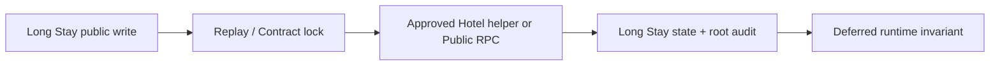

# Long Stay Hotel Platform Runtime Foundation

## 구현 경계

이 패키지는 Long Stay 소유 객체와 Adapter만 append한다. 기존 Hotel Public RPC, Snapshot v2, Operations, Finance, Family Booking, Canonical 정의는 변경하지 않는다.

- Contract: `pending | active | completed | cancelled`
- Monthly Occupancy: `confirmed | cancelled`
- Absence: leave/return Event, Room/Capacity 불변
- Replay/Audit: Write request마다 canonical payload hash와 Long Stay Root Audit 정확히 한 건
- Runtime hold: 실제 checkout 전 Capacity/현재 Allocation `timestamptz 'infinity'`
- Read boundary: `isOpenEnded=true`, 두 Runtime until 값은 `null`; `infinity` 문자열 미노출

## 호출 그래프

월 확정은 최초 달에 Extended prepare/create helper로 Stay와 open-ended Capacity를 만들고 Room을 배정한다. 후속 월은 동일 활성 Capacity를 참조하며, Room/Type 변경이 있을 때만 승인된 기존 Reassign/Move/Extended cross-type 경로를 호출한다.

실제 checkout은 기존 `complete_hotel_check_out()`을 호출한 같은 Transaction에서 Capacity를 실제 시각으로 닫고 Contract를 completed로 전환한다. Reverse는 기존 `reverse_hotel_completion()` 호출 후 open-ended hold와 active Contract를 복원한다.

## Finance 경계

Finance 객체는 만들지 않는다. `long_stay_monthly_occupancies.id`가 향후 월별 Billing Source 후보이며 `service_month`와 결제일은 독립이다.

## Clean QA 결과

- Isolation Guard: PASS (`wxbvwixoeczfvbqurdse`)
- Preflight: `READY_TO_APPLY_LONG_STAY_HOTEL_PLATFORM`
- Migration: PASS
- Postflight: `LONG_STAY_HOTEL_PLATFORM_READY`
- Transaction QA: `LONG_STAY_HOTEL_PLATFORM_TRANSACTION_QA_READY` (12/12)
- 2-session matrix: Room `23P01`, Capacity `23514`, Checkout/Month 상태 오류,
  Checkout/Move `40001`, Absence 경쟁 `40001`; deadlock 0, failed mutation residue 0
- Read projection: `infinity` 미노출 PASS
- Checkout/Reverse open-ended handoff: PASS
- Rollback/Reapply: PASS
- Fixture cleanup: `LONG_STAY_QA_CLEANUP_READY`

## Production Release

- Production ref: `zorvcuskzemehblqdbfj`
- Preflight: `READY_TO_APPLY_LONG_STAY_HOTEL_PLATFORM`
- Migration: PASS
- Postflight: `LONG_STAY_HOTEL_PLATFORM_READY`
- Runtime data: Contract/Occupancy/Absence/Audit 0
- Runtime infinity: Capacity/Allocation 0
- Read-only UI smoke: Hotel Operations, Room Board, Calendar, Today,
  Customer/Dog Profile, Customer Timeline, Family Booking PASS
- Long Stay UI와 Finance 연동은 포함하지 않는다.
